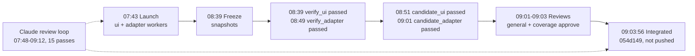

# viewer-clarity-001: Three Reviews Compared

2026-09-23

## Summary

Run viewer-clarity-001 integrated at 09:03:56 UTC on 2026-09-23 with no blockers: every gate passed on attempt 1, both reviewers approved, and no one reported a P0 or P1.

Three reviewers looked at the change in different ways. Claude ran a read-only review loop every 6 minutes while the workers wrote code (15 passes, about 25 findings). The general and coverage reviewers each read the finished candidate once (7 findings between them, all P2). Four findings overlap. The reviewers caught the most important issue, which Claude missed: captured Markdown loads remote images. Claude caught the runtime risks that a one-time review of the final diff cannot see.

## What each reviewer was supposed to do

Each reviewer had a different scope, source of instructions and approval rule.

| Reviewer | Instructions | When and what it saw | Scope | Approval rule |
| --- | --- | --- | --- | --- |
| Claude (loop reviewer) | The user's /loop request, plus a saved rule that a live-run review is read-only | Every 6 min from 07:48 to 09:12, reading the lane worktrees, run state, events and worker panes | Bugs, code quality, file structure, lane ownership, contract mismatches, missing tests; log everything to a Markdown file outside the repo; never edit worktrees, the checkout or run state | None: advisory only, does not gate |
| general | features/project-workflows/reviewers/general.md | Once, 09:01 to 09:03, on the frozen candidate 054d149 | Concrete correctness, security and regression findings; read the diff, full files, verification packets, browser test source and requirements; no edits or commands | Approve only with no unresolved P0/P1; never approve just because tests pass |
| coverage | features/project-workflows/reviewers/coverage.md | Once, 09:01 to 09:03, on the same candidate | Test coverage only: every required behaviour needs a check, unit test or browser scenario that runs on the candidate; report missing tests, tests that don't assert the behaviour, screenshot-only scenarios, and required checks the candidate doesn't run; no style or design issues | Approve only when every required behaviour has a real test; never infer coverage from a passing suite |

## Run timeline

The run took 81 minutes from launch to integration. The two reviewers ran for the last 2 of them.

The ui worker finished at 08:25 and the adapter at 08:39. Build and browser checks were deferred in the worker phase, then gated in the candidate phase on the merged revision.

## What Claude did

Claude ran 15 read-only passes and logged about 25 findings to ~/dev/md-manager-reviews/viewer-clarity-001-review-log.md: 3 P2 still open at the end, about 16 P3, and 6 resolved during the run. It made no edits to the worktrees, the checkout or the run state.

What the passes covered:

- **Code as it was written:** it read each lane's diff as the workers changed it (contract, capture in checks.py, server pass-through, the ui components, the new scroll.ts helper, specs).
- **Runtime:** it read worker panes, the check logs and the verification packets, which is how it found the load-related flakes and timeout pressure.
- **Cross-lane contract:** it hand-checked the ui's type code and fixtures against the adapter's schema before the merged build ran.
- **Closing loops:** it revisited earlier findings and closed or downgraded them with evidence (for example, the review diff is still restricted to patch at contracts/projects/v1.ts:267).

P2s still open at the end:

| Finding | Where | Pass |
| --- | --- | --- |
| server/projects.test.ts, including the served-files scenario, is never run by a gating check | package.json:15, adapter policy checks | 11 |
| workflow-unit fails intermittently under load; one full run took 911 s against a 1200 s timeout | workflow/test_automatic.py | 7-8 |
| This run captured no files: the verifier used the base code, before capture existed | verification/worker/ui/1/packet.json | 12 |

Selected P3s: the zod refine and hand-written JSON Schema can drift; a captured file's path isn't tied to its bytes when the packet is re-checked; fileAnchorId ids can collide; focusPath is read only once, at mount; the graph ignores print transport; verifier nodes get the is-controller class; scroll.ts uses variables before they're declared; reversed line ranges are silently shortened; the source view creates one element per line; the ui worker ran its self-checks on a scratch copy outside its worktree.

## What the two reviewers did

Both reviewers approved candidate 054d149 about 2 minutes after launch, with 7 findings between them, all P2 and all left open. General approved at 09:03:51 with 4 findings, and coverage at 09:03:32 with 3.

| # | Reviewer | Lane | Finding |
| --- | --- | --- | --- |
| 1 | general | ui | Captured Markdown is rendered through src/document/Markdown.tsx, which loads remote https images and makes http(s) links live (Markdown.tsx:28-36). Opening a worker node fetches URLs the worker chose, which breaks section 2 of the spec. |
| 2 | general | ui | The required-check link now goes to the top of the verify node instead of scrolling to the check (WorkerInputs.tsx). |
| 3 | general | ui | The verify view's "ownership outcome" is worked out from the phase and gate status, but shown as a fact of the result (NodeDetail.tsx VerifiedEvidence). |
| 4 | general | adapter | contracts/projects/examples.ts servedWorkerResult uses verify_ui and points to a route that doesn't exist. |
| 5 | coverage | adapter | server/projects.test.ts:934 (served-files) and :948 (malformed files) never run on the candidate; nothing on the candidate asserts text/plain, nosniff or RESULT_INVALID. |
| 6 | coverage | ui | The six new browser scenarios passed only in the candidate phase; the worker-phase fixture path failed with a ZodError and was deferred, so it has never passed against the real schema. |
| 7 | coverage | ui | findings-by-reviewer can't tell a reviewer's own verdict from the run verdict, because every reviewer in the test data approved (clarity.spec.ts:312-313). |

## Side-by-side comparison

Four findings overlap. The reviewers had 3 that Claude missed, and Claude had about 20 that the reviewers didn't raise.

| Finding | Claude | general | coverage |
| --- | --- | --- | --- |
| Captured Markdown loads remote images and live links | Missed (only checked for raw HTML) | P2 | - |
| server/projects.test.ts is never run by a gate | P2 (pass 11) | - | P2 |
| New browser scenarios never passed in the worker phase against the real schema | Partly: flagged, then marked resolved when candidate_ui passed | - | P2 |
| Check link no longer scrolls to the check | P3 (pass 4) | P2 | - |
| Ownership outcome is inferred but shown as fact | P3 (pass 9) | P2 | - |
| examples.ts points to a route that doesn't exist | Missed | P2 | - |
| findings-by-reviewer test data can't tell reviewer verdict from run verdict | Missed | - | P2 |
| workflow-unit flaky under load, close to its timeout | P2 | - | - |
| This run captured no files (verifier ran base code) | P2 | - | - |
| Refine and JSON Schema can drift; path not tied to bytes; id collisions; UI details (about 16 P3s) | P3 | - | - |

**Severity calibration:** the reviewers rated usability regressions and "inference shown as fact" as P2; Claude rated the same issues P3. On the one finding all rated the same way (the ungated server tests), everyone chose P2.

**Why each side saw different things:** Claude watched the run live, so it saw runtime behaviour (load, timeouts, the verifier's code version, scratch copies) that isn't in any diff. The reviewers read the final candidate as a whole, followed untrusted content into the components that render it, and asked whether each test's data could actually fail.

## Scorecard against each mandate

General fully met its mandate. Claude met most of its mandate but missed the security-relevant finding. Coverage found the right gaps but approved despite its own rule.

| Reviewer | Met | Fell short |
| --- | --- | --- |
| Claude | Stayed read-only for all 15 passes; logged every pass with severity and file:line references; covered bugs, quality, structure, ownership and contracts; stopped the loop and wrote a final summary when the run ended | Missed the remote-image issue in captured Markdown; closed pass 9's concern too early; missed two test-quality gaps and one example-route error |
| general | Found concrete correctness and security issues, including the most important one; approved with no P0/P1, as its rule allows | Rated some usability items P2 that are arguably P3; nothing else |
| coverage | Found required checks the candidate doesn't run (#5), a scenario that never ran in one phase (#6), and a test that can't fail (#7) | Its brief says "approve only when every required behaviour has a real test". It reported that served-files never runs on the candidate and still approved. Under its own rule that should have been a block or a request for changes. |

**Lessons for Claude's loop reviews:**

1. Follow untrusted content (worker-written files, finding text) into every component that renders it, and check it against the spec's security wording.
2. For each new test, ask whether its test data could fail when the behaviour is wrong, not just whether the test exists.
3. Don't close a concern because one phase passed; check which phases actually ran.
4. Calibrate: a regression in the reader's workflow is P2, not P3.

## Follow-ups before run 2

Fix the Markdown issue before run 2 (viewer-clarity-002, print transport), because run 2 is the first run whose verifier actually captures files.

- [ ] Render captured Markdown with images and external links inert (a variant of Markdown.tsx or a component override in CreatedFiles).
- [ ] Add server/projects.test.ts to test:unit or to a policy check, so served-files runs on the candidate.
- [ ] Add a findings-by-reviewer case where the reviewers' verdicts differ (for example RUN_REVIEWER_BLOCKED).
- [ ] Fix servedWorkerResult in contracts/projects/examples.ts to use a real results route.
- [ ] Decide whether coverage should block when a required scenario never runs on the candidate, and tighten its brief or the gate to match.
- [ ] Look into the test_automatic flake under load before it blocks a gate.
- [ ] Merge feature/viewer-clarity/viewer-clarity-001 (054d149) to main; it hasn't been pushed.
